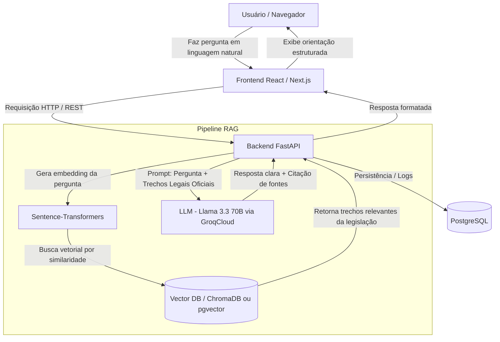

# ⚖️ Assistente Inteligente de Orientação sobre Direitos Trabalhistas

<div align="center">


<p align="center">
  <strong>Democratizando o acesso à informação trabalhista no Brasil por meio de Inteligência Artificial generativa e Recuperação Aumentada de Informação (RAG).</strong>
</p>

[Sobre o Projeto](#-sobre-o-projeto) •
[Arquitetura](#-arquitetura-e-fluxo-rag) •
[Funcionalidades](#-funcionalidades) •
[Tecnologias](#-tecnologias-utilizadas) •
[Como Executar](#-como-executar-o-projeto) •
[Roadmap](#-plano-de-trabalho) •
[Equipe](#-equipe)

</div>

---

## 📌 Sobre o Projeto

O **Assistente Inteligente de Orientação sobre Direitos Trabalhistas** é uma aplicação web desenvolvida no âmbito do **Projeto Integrador IV** do curso de **Ciência da Computação (turma 6HC1)**.

### 🎯 Problema e Justificativa
O acesso e a compreensão da legislação trabalhista brasileira (como a CLT) costumam ser desafiadores para grande parte dos trabalhadores. As leis utilizam termos técnicos complexos ("juridiquês") e as informações encontram-se dispersas em diversas fontes. 

Embora modelos de linguagem de grande porte (LLMs) auxiliem na simplificação de textos, modelos genéricos podem **alucinar** ou apresentar respostas imprecisas sem respaldo legal. Por isso, este projeto utiliza a técnica de **Retrieval-Augmented Generation (RAG)**, fundamentando as respostas em documentos oficiais e legislações vigentes antes de sintetizar as orientações em linguagem clara e acessível.

### 🌍 Impacto Social & ODS
- **Público Impactado:** Trabalhadores e ex-trabalhadores da **Região Metropolitana da Grande Vitória (ES)** e de todo o Brasil que buscam esclarecer dúvidas iniciais sobre seus direitos.
- **Alinhamento com os Objetivos de Desenvolvimento Sustentável:** Contribuição direta ao **ODS 8 — Trabalho Decente e Crescimento Econômico** da ONU e à área de **Direitos Humanos e Justiça**.

> ⚠️ **Aviso Legal (Disclaimer):** Esta aplicação possui finalidade **estritamente informativa e educativa**. As orientações geradas pela inteligência artificial **não substituem** a consulta formal a advogados, sindicatos, Ministério do Trabalho ou órgãos de atendimento jurídico especializado.

---

## 💡 Funcionalidades

- 💬 **Perguntas em Linguagem Natural:** O usuário pergunta diretamente sobre situações do seu cotidiano (ex.: *"Trabalhei no feriado, quanto devo receber?"* ou *"Fui demitido sem justa causa, quais são meus prazos e direitos?"*).
- 📚 **Respostas Fundamentadas e Fontes Citadas:** Cada resposta é acompanhada pelas referências normativas e fontes oficiais consultadas (artigos da CLT, súmulas, etc.).
- 🔄 **Linguagem Acessível e Didática:** Conversão do vocabulário jurídico para explicações intuitivas e diretas.
- 🛡️ **Mitigação de Alucinações:** Geração condicionada estritamente aos contextos recuperados da base confiável de documentos.
- 🚫 **Tratamento de Perguntas Fora de Escopo:** Comportamento seguro e direcionamento caso o usuário faça perguntas não relacionadas aos direitos trabalhistas ou que exijam parecer jurídico formal.
- 📑 **Cobertura Temática:**
  - Férias e abono pecuniário
  - 13º Salário
  - Jornada de trabalho e horas extras
  - Aviso prévio (trabalhado e indenizado)
  - FGTS e multa rescisória
  - Encerramento do contrato de trabalho (rescisão, justa causa, acordo)

---

## 🏗️ Arquitetura e Fluxo RAG

A solução adota uma arquitetura em camadas baseada em **RAG (Retrieval-Augmented Generation)**:



1. **Ingestão:** Leis, súmulas e cartilhas trabalhistas são divididas em chunks e convertidas em embeddings.
2. **Recuperação:** A pergunta do usuário busca os chunks semanticamente mais próximos na base vetorial.
3. **Geração Aumentada:** O modelo Llama 3.3 70B recebe o contexto recuperado e gera uma explicação simples com citação das fontes.

---

## 🛠️ Tecnologias Utilizadas

| Camada / Função | Tecnologia | Descrição |
| :--- | :--- | :--- |
| **Frontend** | React / Next.js | Interface moderna, responsiva e acessível para o usuário final |
| **Backend** | Python & FastAPI | API REST assíncrona, rápida e escalável |
| **Modelo de Linguagem (LLM)** | Llama 3.3 70B | Modelo de ponta executado com baixa latência via **GroqCloud** |
| **Embeddings** | Sentence-Transformers | Modelos para geração de vetores semânticos textuais |
| **Recuperação Vetorial** | ChromaDB / pgvector | Indexação e busca por similaridade de cosseno/vetores |
| **Banco Relacional** | PostgreSQL | Persistência de dados, histórico e configurações |
| **Testes Automatizados** | pytest | Testes unitários, de integração e validação do pipeline |
| **Deploy & Hospedagem** | Render / Railway | Ambiente em nuvem para hospedagem do backend e frontend |
| **Versionamento** | Git & GitHub | Controle de versão e colaboração em equipe |

---

## 📋 Plano de Trabalho

O cronograma do projeto integrador está estruturado nas seguintes etapas:

- [x] **Etapa 1:** Definição do escopo, caracterização do problema e público-alvo, levantamento de fontes confiáveis e estruturação inicial do repositório.
- [ ] **Etapa 2:** Coleta, limpeza e preparação dos documentos legais para a base de conhecimento.
- [ ] **Etapa 3:** Desenvolvimento do protótipo do componente de IA (mecanismo RAG, embeddings e geração via Llama 3.3).
- [ ] **Etapa 4:** Desenvolvimento e integração do frontend e backend, implementação de testes automatizados e avaliações iniciais do modelo.
- [ ] **Etapa 5:** Refinamento contínuo, ampliação da cobertura de testes e mitigação de alucinações/casos de borda.
- [ ] **Etapa Final:** Deploy em produção (Render/Railway), análise dos indicadores de impacto, consolidação da documentação e produção do vídeo de apresentação.

---

## 📊 Métricas e Avaliação da IA

O componente de Inteligência Artificial será submetido a baterias de testes com perguntas controladas, avaliando:
- **Precisão e Relevância:** Aderência da resposta aos termos da legislação aplicável.
- **Taxa de Alucinação:** Ausência de regras ou valores inventados que não constem na base oficial.
- **Robustez Fora de Escopo:** Capacidade de recusar educadamente perguntas não relacionadas ao domínio trabalhista.
- **Clareza e Compreensão:** Facilidade de entendimento da linguagem para o público leigo.

---

## 🚀 Como Executar o Projeto

### Pré-requisitos
- [Python 3.10+](https://www.python.org/)
- [Node.js 18+](https://nodejs.org/) e `npm`
- Instância do [PostgreSQL](https://www.postgresql.org/) (opcionalmente com extensão `pgvector`)
- Chave de API da [GroqCloud](https://console.groq.com/)

### 1. Clonar o repositório
```bash
git clone https://github.com/GabrielaGavi/assistente-ia-direitos-trabalhistas.git
cd assistente-ia-direitos-trabalhistas
```

### 2. Configuração do Backend (FastAPI)
```bash
# Entrar no diretório do backend (quando estruturado)
cd backend

# Criar e ativar o ambiente virtual
python -m venv venv
# No Windows:
.\venv\Scripts\activate
# No Linux/macOS:
source venv/bin/activate

# Instalar dependências
pip install -r requirements.txt

# Configurar variáveis de ambiente (.env)
cp .env.example .env
# Preencha GROQ_API_KEY, DATABASE_URL, etc.

# Iniciar o servidor
uvicorn main:app --reload
```

### 3. Configuração do Frontend (Next.js / React)
```bash
# Em um novo terminal, entrar no diretório do frontend
cd frontend

# Instalar dependências
npm install

# Iniciar o servidor de desenvolvimento
npm run dev
```

Acesse a interface no navegador em: `http://localhost:3000` (Frontend) e a documentação da API em `http://localhost:8000/docs` (Swagger Backend).

---

## 👥 Equipe

Projeto desenvolvido pelos alunos do curso de **Ciência da Computação – Turma 6HC1**:

- **Gabriela Gave Gavi**
- **Jeronymo Francisco Moreira Neto**
- **José Luiz dos Santos Azeredo Mendes**
- **Pedro Henrique Bispo Sarmento**
- **Pedro Henrique Ferreira Bonela**
- **Wanessa Guisso**

---

## 📄 Licença

Este projeto é desenvolvido para fins acadêmicos como parte do Projeto Integrador IV. Consulte os arquivos do repositório para detalhes sobre termos de uso e licença.
